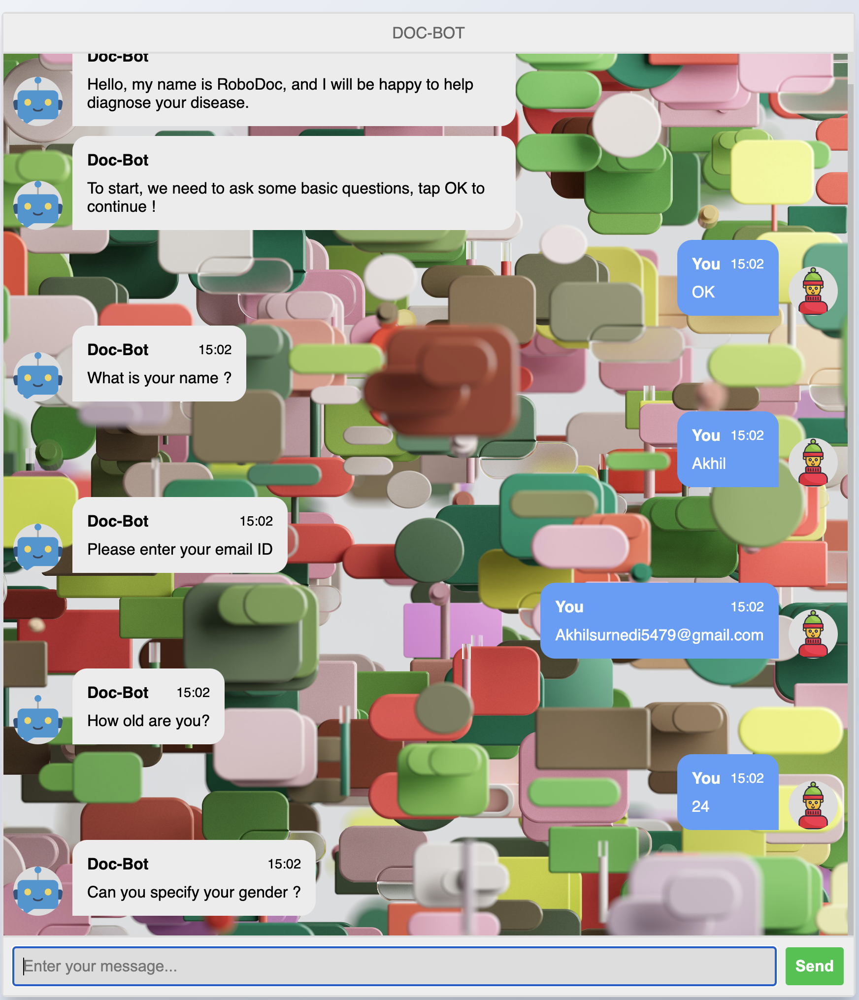
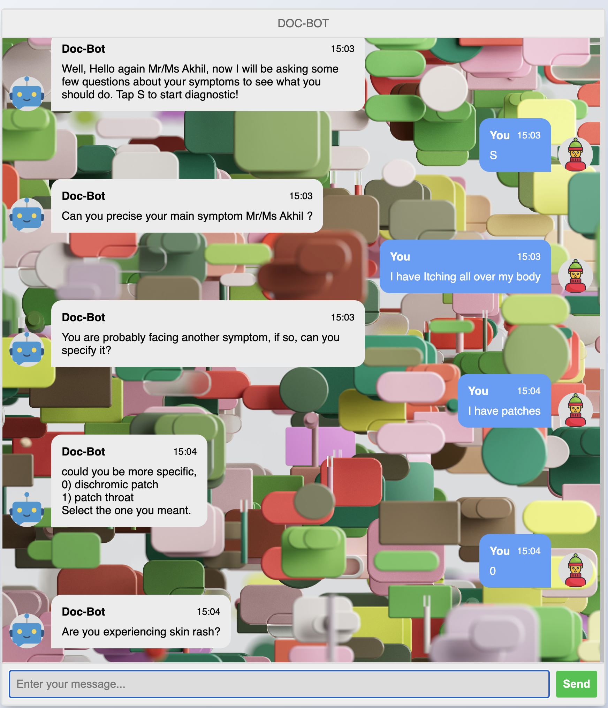
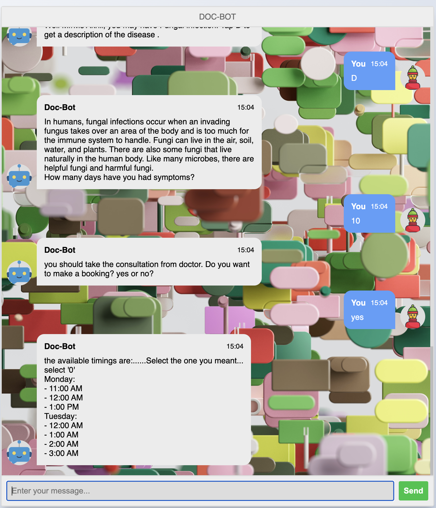
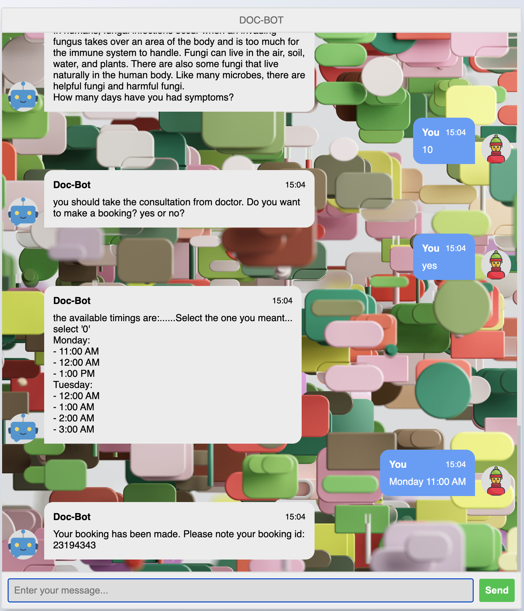

# Doc-Bot
This is a chatbot where user can give the symptoms and get a prediction of the disease they have.

Based on the severity of the disease the chatbot will provide a list of day and times available for the user to make a booking.

Based on the booking ID, The patient/doctor can retrieve the booking details.

